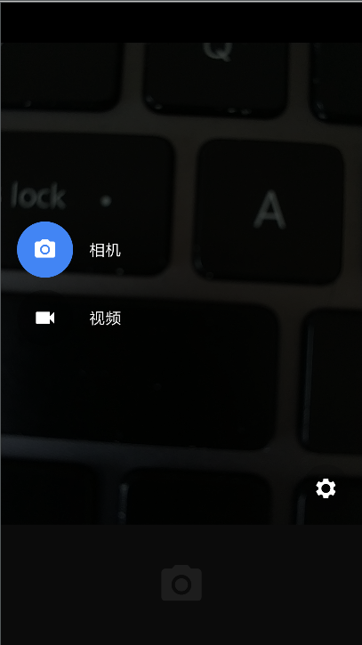

## Description
fork from https://android.googlesource.com/platform/packages/apps/Camera2/+/android-7.1.2_r36

adjust directory structure for android studio

## How get this from AOSP

create a android studio project
copy `/packages/apps/Camera2` to  the new project.
use gradle config `src dir` and `res dir`,like below:

```
 sourceSets {
        main {
            res.srcDirs = ['src/main/res', 'src/main/res_p']
            java.srcDirs = ['src/main/java', 'src_pd', 'src_pd_gcam']
        }
    }

```

you will found some reference code is missing.The missing code in `frameworks/ex/camera2`.
there are 3 project in it. so I create 3 new module and compile them.

then clean and build , you can run it on your android device like below.


 

 